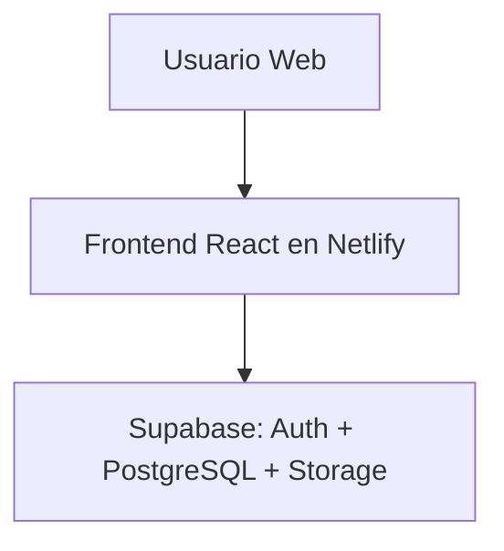

-----------------
Objetivo: estructura inicial de la arquitectura del proyecto
-----------------

# Herramientas a utilizar:
## Frontend
- React + Vite (TypeScript) → SPA rápida y moderna.
- TailwindCSS → estilos utilitarios para prototipar rápido.

## Backend / Persistencia
- Supabase → provee:
     - PostgreSQL gestionado (gratis en plan académico).
     - Autenticación integrada (registro/login con email y contraseña).
     - Encriptación de contraseñas ya incluida.
     - Row Level Security (RLS) para permisos por rol (lector vs admin).

## Despliegue
- Netlify → hosting gratuito del frontend React.
- CI/CD automático desde GitHub.
- Variables de entorno para conectar con Supabase.
- CDN global para servir la app.

## Arquitectura propuesta
