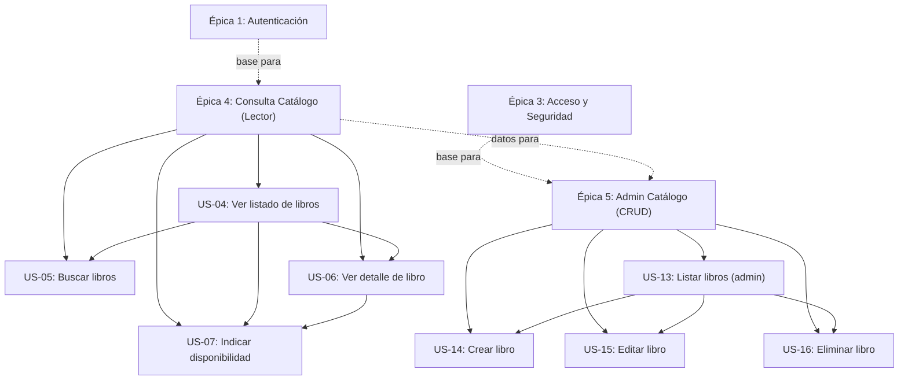
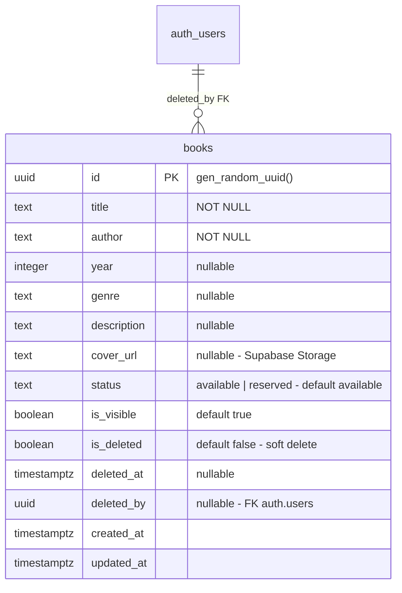

# Épicas — Catálogo de Libros (Release 1)

> **Proyecto:** montiLibrary  
> **Release:** 1 — MVP  
> **Fecha de generación:** 2026-06-10  
> **Stack:** React + Vite (TypeScript) + TailwindCSS | Supabase (Auth + PostgreSQL + Storage) | Netlify

---

## Épica 4: Consulta del Catálogo de Libros (Lector)

**Objetivo:** Permitir que los lectores autenticados exploren el catálogo de libros de la biblioteca, busquen títulos, vean detalles completos y visualicen claramente la disponibilidad de cada libro.

**Valor de negocio:** El catálogo es la funcionalidad core de la biblioteca. Sin él, los lectores no tienen razón para usar la plataforma. Es el producto mínimo viable que justifica la existencia del sistema.

**Prioridad:** Must Have

| ID | Historia | Rol | Prioridad |
|----|----------|-----|-----------|
| US-04 | [Ver listado de libros](./US-04_ver_listado_libros.md) | Lector | Must Have |
| US-05 | [Buscar libros por título o autor](./US-05_buscar_libros.md) | Lector | Must Have |
| US-06 | [Ver detalle de libro](./US-06_ver_detalle_libro.md) | Lector | Must Have |
| US-07 | [Indicar disponibilidad](./US-07_indicar_disponibilidad.md) | Lector | Must Have |

**Dependencias:** Depende de Épica 1 (autenticación debe existir para acceder al catálogo).

---

## Épica 5: Administración del Catálogo (CRUD Administrativo)

**Objetivo:** Proporcionar al administrador herramientas completas para gestionar el inventario de libros: crear, listar, editar y eliminar libros, incluyendo la gestión de portadas e imágenes.

**Valor de negocio:** Sin esta funcionalidad, el catálogo depende de inserciones manuales en la base de datos. El admin necesita autonomía para mantener actualizado el inventario sin intervención técnica.

**Prioridad:** Should Have

| ID | Historia | Rol | Prioridad |
|----|----------|-----|-----------|
| US-13 | [Listar libros para admin](./US-13_listar_libros_admin.md) | Administrador | Must Have |
| US-14 | [Crear libro](./US-14_crear_libro.md) | Administrador | Must Have |
| US-15 | [Editar libro](./US-15_editar_libro.md) | Administrador | Should Have |
| US-16 | [Eliminar libro](./US-16_eliminar_libro.md) | Administrador | Should Have |

**Dependencias:** Depende de Épica 1 (autenticación) y Épica 3 (rutas protegidas por rol admin).

---

## Diagrama de Dependencias

---

## Schema de Datos Asociado

## Storage Asociado

| Bucket | Acceso lectura | Acceso escritura | Límite | Tipos |
|--------|---------------|-----------------|--------|-------|
| `book-covers` | Público (cualquier usuario) | Solo Admin | 5MB | JPEG, PNG, WebP, GIF |

## Roles del Sistema (ampliado)

| Rol | Acceso Catálogo | Acceso Admin Catálogo |
|-----|-----------------|----------------------|
| **Visitante** | ❌ No (redirige a login) | ❌ No |
| **Lector** | ✅ Solo libros visibles y activos | ❌ No |
| **Administrador** | ✅ Todos los libros | ✅ CRUD completo |
