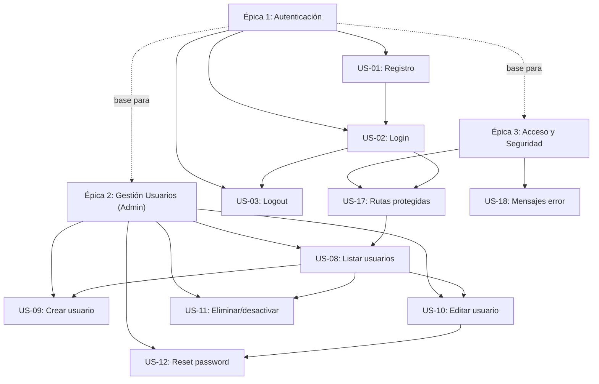
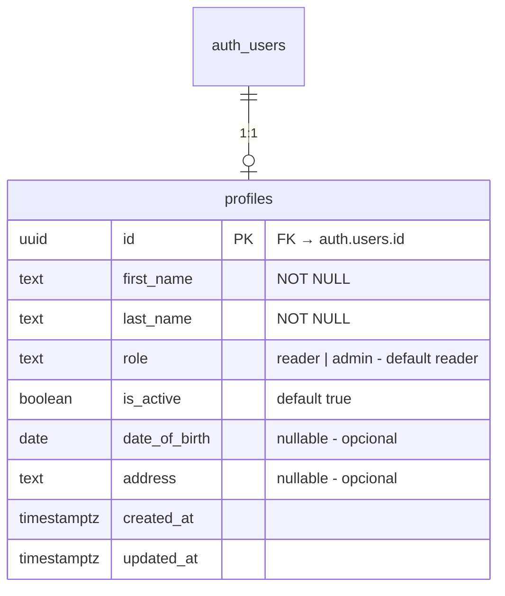

# Épicas — Login y Gestión de Usuarios (Release 1)

> **Proyecto:** montiLibrary  
> **Release:** 1 — MVP  
> **Fecha de generación:** 2026-06-09  
> **Stack:** React + Vite (TypeScript) + TailwindCSS | Supabase (Auth + PostgreSQL) | Netlify

---

## Épica 1: Autenticación de Usuarios

**Objetivo:** Permitir que los visitantes se registren, inicien sesión y cierren sesión de forma segura, habilitando el acceso al sistema como lectores autenticados.

**Valor de negocio:** Sin autenticación no hay acceso al catálogo ni diferenciación de roles. Es la base de toda la plataforma.

**Prioridad:** Must Have

| ID | Historia | Rol | Prioridad |
|----|----------|-----|-----------|
| US-01 | [Registro de usuario](./US-01_registro_usuario.md) | Visitante | Must Have |
| US-02 | [Inicio de sesión](./US-02_inicio_sesion.md) | Lector | Must Have |
| US-03 | [Cierre de sesión](./US-03_cierre_sesion.md) | Lector | Must Have |

**Dependencias:** Ninguna — es la base del sistema.

---

## Épica 2: Gestión de Usuarios (CRUD Administrativo)

**Objetivo:** Proporcionar al administrador herramientas completas para gestionar las cuentas de usuarios del sistema: crear, listar, editar, desactivar/eliminar y forzar reset de contraseña.

**Valor de negocio:** El administrador necesita control total sobre las cuentas para mantener la seguridad y operación de la plataforma.

**Prioridad:** Should Have

| ID | Historia | Rol | Prioridad |
|----|----------|-----|-----------|
| US-08 | [Listar usuarios](./US-08_listar_usuarios.md) | Administrador | Must Have |
| US-09 | [Crear usuario](./US-09_crear_usuario.md) | Administrador | Should Have |
| US-10 | [Editar usuario](./US-10_editar_usuario.md) | Administrador | Should Have |
| US-11 | [Eliminar/desactivar usuario](./US-11_eliminar_desactivar_usuario.md) | Administrador | Should Have |
| US-12 | [Reset de contraseña por admin](./US-12_reset_password_admin.md) | Administrador | Could Have |

**Dependencias:** Depende de Épica 1 (autenticación debe existir para gestionar usuarios).

---

## Épica 3: Acceso y Seguridad

**Objetivo:** Garantizar que las rutas del sistema estén protegidas adecuadamente según el rol del usuario, y que los mensajes de error sean claros y seguros.

**Valor de negocio:** Seguridad fundamental para proteger datos y funcionalidades. Mejora la experiencia de usuario con feedback comprensible.

**Prioridad:** Must Have

| ID | Historia | Rol | Prioridad |
|----|----------|-----|-----------|
| US-17 | [Acceso a rutas protegidas](./US-17_rutas_protegidas.md) | Visitante | Must Have |
| US-18 | [Mensajes de error y feedback](./US-18_mensajes_error.md) | Todos | Must Have |

**Dependencias:** Depende de Épica 1 (necesita autenticación para verificar acceso).

---

## Diagrama de Dependencias

---

## Schema de Datos Asociado

## Roles del Sistema

| Rol | Descripción | Acceso |
|-----|-------------|--------|
| **Visitante** | Usuario no autenticado | Solo login/registro |
| **Lector** | Usuario registrado y autenticado | Catálogo (lectura) |
| **Administrador** | Usuario con permisos elevados | CRUD usuarios + CRUD catálogo |
