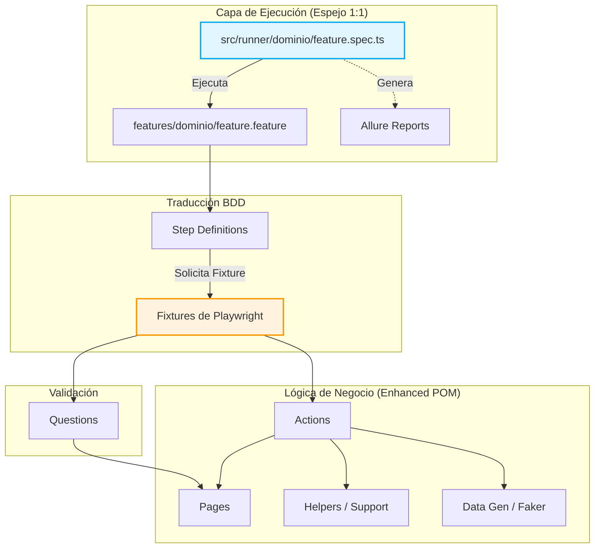

# [ADR-001]: Arquitectura Base y Stack Tecnológico para Automatización E2E
**Fecha:** 2026-05-08

**Estado:** Aceptado

## 1. Contexto y Problema
El proyecto requiere un framework de automatización de pruebas E2E que cumpla con el estándar de BDD (Behavior-Driven Development) para facilitar la comunicación con el negocio, sin sacrificar el rendimiento y las ventajas técnicas de las herramientas modernas. Adicionalmente, se necesita una estructura escalable que evite el antipatrón de *"Page Objects monolíticos"* y que facilite el mantenimiento a largo plazo, la generación de datos dinámicos y la trazabilidad de los resultados.

## 2. Decisión
Se ha decidido implementar la siguiente *arquitectura* y *stack tecnológico*:

**Stack Principal:** Playwright + TypeScript + playwright-bdd.

**Nota:** La librería *playwright-bdd* actuará como puente, permitiendo inyectar *Fixtures nativos* directamente en los *Steps de Cucumber*.

**Reportería:** *Allure Reports* para la generación de "documentación viva".

### *Patrón de Diseño (Enhanced POM / Screenplay-inspired):*

**Pages:** Clases que contendrán exclusivamente *selectores* y *constantes* de UI.

**Actions:** Clases o funciones encargadas de la *lógica de interacción* (verbos).

**Questions:** Clases o funciones genéricas responsables de las *aserciones* y obtención de *estados*.

### Componentes Transversales (Carpeta common):

Se implementará una estructura espejo para elementos globales (ej. Navbars, Footers, Modals). Existirá un *src/pages/common/* para los selectores y su contraparte *src/actions/common/* para la interacción.

### Capa de Soporte (Support):

Estará compuesta por *Helpers* (utilidades técnicas, formateo, etc.) y *Data Generation* (utilizando la librería faker.js). Esta capa será consumida directamente por la capa de *Actions* para mantener la lógica de negocio separada de la complejidad técnica.

### Inyección de Dependencias:

Se utilizarán los *Fixtures* extendidos de Playwright para centralizar el mapeo de los *Page Objects*. Esto proveerá un punto de entrada único y evitará la instanciación manual reiterativa en los Step Definitions.

### Capa de Ejecución (Runner Layer):

Se creará una capa en *src/runner/* con archivos *.spec.ts*.

Para garantizar la mantenibilidad y facilitar la ejecución en paralelo, la estructura de carpetas y archivos de esta capa será un espejo exacto (1:1) de la estructura de la carpeta *features/*.

## 3. Estructura y Flujo del Proyecto

## 4. Consecuencias
### Positivas:

**Mantenibilidad Extrema:** La simetría en las carpetas (common/, runners vs features) hace que el proyecto sea altamente predecible para cualquier automatizador que se incorpore.

**Responsabilidad Única:** Separar Pages de Actions mantiene el código limpio y los archivos pequeños.

**Potencia de Ejecución:** Gracias a la capa de runners modulares, se heredan todas las ventajas nativas del motor de Playwright (paralelismo, sharding, UI mode).

### Negativas / Riesgos:

**Boilerplate Inicial:** Requiere una configuración técnica meticulosa al inicio para alinear los fixtures de Playwright con el ecosistema de Cucumber.

**Curva de Aprendizaje:** El equipo deberá asimilar la estricta separación de responsabilidades entre Actions, Questions y Pages.