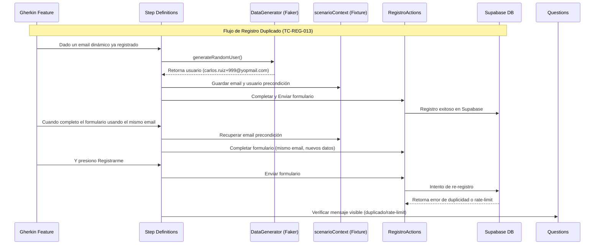

# [ADR-005]: Estrategia de Datos Dinámicos y Contexto Compartido (scenarioContext)
**Fecha:** 2026-06-26

**Estado:** Aceptado

## 1. Contexto y Problema
En las pruebas automatizadas de registro de usuarios, el uso de datos fijos parametrizados en los archivos de características (`.feature`) generaba una alta dependencia de datos. Esto provocaba fallos recurrentes (como errores de "email duplicado" o alertas de "rate-limiting" en Supabase) al ejecutar la suite de forma consecutiva o en paralelo, ya que se intentaba registrar repetidamente la misma información.

Se necesitaba una solución que permitiese:
1. Eliminar datos fijos del archivo de características.
2. Generar datos únicos y válidos a nivel de ejecución para cada campo (Nombre, Apellido, Email, Contraseña).
3. Compartir valores generados en los pasos de precondición (como el email de un usuario ya registrado) con pasos subsecuentes del mismo escenario para realizar validaciones E2E reales de duplicidad contra el servidor de producción.

## 2. Decisión
Se decidió implementar las siguientes soluciones de diseño y arquitectura:

1. **Generación de Datos con Faker:**
   Implementar un helper nativo `DataGenerator.ts` en la capa de soporte (`support/`) utilizando la librería `@faker-js/faker`. Este helper centraliza la lógica para generar nombres, apellidos y correos electrónicos dinámicos únicos (con el formato `nombre.apellido.numero@yopmail.com`), además de contraseñas que cumplan estrictamente las reglas de validación del frontend.

2. **Contexto Compartido de Escenario (`scenarioContext`):**
   Crear un fixture de Playwright llamado `scenarioContext` de tipo `{ [key: string]: any }` instanciado automáticamente por cada escenario de prueba. Este almacén de estado en memoria permite a los step definitions guardar información dinámica intermedia (como `precondicionUser` o `email`) en un paso de Cucumber y recuperarla en otro del mismo escenario, manteniendo la encapsulación y la limpieza de los steps.

3. **Abstracción de Escenarios Gherkin (Generic Steps):**
   Modificar los archivos de características `.feature` para describir el comportamiento de forma genérica en lugar de pasar parámetros hardcodeados en tablas de datos. Ejemplo:
   * **Antes:** `Cuando completo el formulario con carlos.ruiz@yopmail.com`
   * **Después:** `Cuando completo el formulario de registro con datos obligatorios válidos dinámicos`

4. **Tolerancia al Rate-Limit de Supabase en Producción:**
   Adaptar la aserción de la pregunta `verificarMensajeErrorVisible` para tolerar de forma flexible tanto el mensaje de email duplicado (`"Este email ya se encuentra registrado"`) como el de control de flujo (`"For security purposes..."`) en entornos reales de pruebas consecutivas.

## 3. Estructura y Flujo

## 4. Consecuencias

### Positivas:
* **Independencia Total de Datos:** Los escenarios exitosos y de error pueden ejecutarse indefinidamente sin colisiones de base de datos ni necesidad de scripts de limpieza.
* **Pruebas E2E Verdaderas:** Validamos el comportamiento real del backend de Supabase sin depender de mocks de red (`page.route`).
* **Mayor Legibilidad en Gherkin:** Los archivos de características describen el comportamiento de negocio y quedan libres de tecnicismos como correos inventados.

### Negativas / Riesgos:
* **Dependencia de Supabase:** La suite requiere conectividad y disponibilidad de la base de datos real para pasar los escenarios E2E.
* **Consumo de Memoria en scenarioContext:** Guardar grandes cantidades de datos compartidos podría degradar la claridad si no se limita a cadenas de texto o perfiles básicos.
