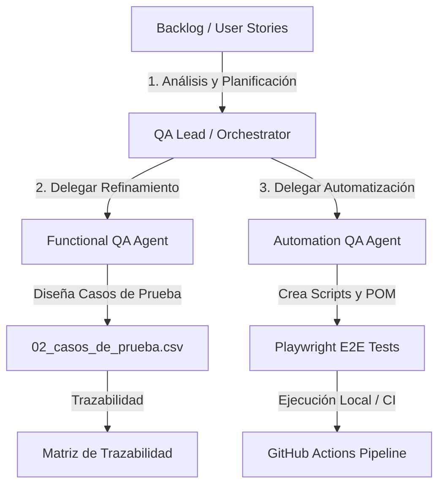

# Onboarding - Orquestador y Estrategia de QA (QA Lead)

Esta guía documenta el rol del **QA Lead / Agent Orchestrator** y el flujo estratégico para gestionar procesos de calidad en el proyecto utilizando agentes de IA.

---

## 1. El Rol del Agent Orchestrator (QA Lead)
El agente orquestador es el líder técnico del proceso de QA. Sus responsabilidades principales no son de ejecución directa, sino de dirección y control:
* **Analizar y Estimar:** Evaluar el backlog de requerimientos (Historias de Usuario) para identificar el impacto en QA.
* **Definir la Estrategia:** Decidir qué se prueba manualmente y qué se automatiza (definición de tags como `@smoke`, `@regression`, etc.).
* **Delegación:** Dispatchar tareas a los roles operativos:
  * Delegar refinamiento y diseño de pruebas manuales al **Functional QA Agent** (`/qa-functional`).
  * Delegar automatización e implementación al **Automation QA Agent** (`/qa-automation`).
* **Memoria de Sprint:** Mantener actualizado el log de decisiones en `docs/qa-memory/decisions-log.md` para mantener la continuidad entre sesiones.

---

## 2. Flujo de Trabajo en el Sprint
El ciclo de vida del sprint gestionado por agentes de IA sigue estos pasos:

---

## 3. Integración en CI/CD (GitHub Actions)
El repositorio cuenta con un pipeline de CI/CD configurado en `.github/workflows/` que actúa como puerta de enlace de calidad (Quality Gate):
* **Linting:** Verifica los estándares de código de TypeScript mediante ESLint y Prettier.
* **Pruebas Automatizadas:** Ejecuta la suite de Playwright en Chromium antes de cada despliegue o Pull Request.
* **Manejo de Errores de Rate-Limit:** Si el pipeline de CI/CD interactúa con servicios reales (como Supabase) y falla por limitación de frecuencia de peticiones, el error se registra directamente en el reporte de ejecución del pipeline, indicando a los agentes humanos o automatizados la necesidad de reintentar de forma controlada.

---

## 4. Registro de Decisiones de Arquitectura (ADRs)
Cualquier cambio de impacto estructural se documenta bajo el formato de **ADR (Architectural Decision Records)** en la carpeta `docs/adr/`.
* [ADR-001 - Arquitectura Base y Stack Tecnológico](file:///c:/Users/FernandoMontiel/Documents/Fer/demos/Demo_ProcesoQA_IA/demo_library_playwright/docs/adr/ADR001_arquitectura_base_stack_tecnologico.md)
* [ADR-002 - Convenciones de Nomenclatura y Estándares](file:///c:/Users/FernandoMontiel/Documents/Fer/demos/Demo_ProcesoQA_IA/demo_library_playwright/docs/adr/ADR002_convenciones_nomenclatura_estandares_de_codigo.md)
* [ADR-003 - Estrategia de Locators](file:///c:/Users/FernandoMontiel/Documents/Fer/demos/Demo_ProcesoQA_IA/demo_library_playwright/docs/adr/ADR003_estrategia_de_locators.md)
* [ADR-004 - Estrategia de CI/CD](file:///c:/Users/FernandoMontiel/Documents/Fer/demos/Demo_ProcesoQA_IA/demo_library_playwright/docs/adr/ADR004_estrategia_ci_cd_github_actions.md)
* [ADR-005 - Estrategia de Datos Dinámicos y scenarioContext](file:///c:/Users/FernandoMontiel/Documents/Fer/demos/Demo_ProcesoQA_IA/demo_library_playwright/docs/adr/ADR005_estrategia_de_datos_dinamicos_y_contexto.md)
